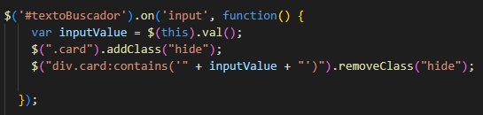
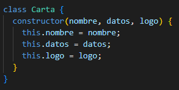
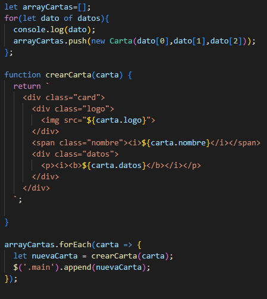

# **Entrega 4 Búsqueda JQuery**
## *Contornos 1ºCS DAW 23/24*  
>Actividad:
Creación de un simulacro de página con cartas de presentación de clientes para realizar búsqueda por filtro

## **Funcionamiento básico:**
El programa se divide en:
* **main.js:** contiene todo el contenido Javascript/Jquery que se encarga de la lógica de búsqueda y creación dinámica de las cartas de los clientes.
* **index.html:** establece la estructura básica de la página.
* **style.css:** código CSS de la página.
* **Recursos png:** materiales para representar a los clientes.

 
Con este código comprobamos el valor del input y escondemos todo lo que no coincida con dicho valor.

 
Los datos de los clientes se convertirán a la clase Carta

 La función crearCarta se ocupa de añadir las estructuras div que componen las cartas al contenedor "main".
## Recursos
[StackOverflow](https://stackoverflow.com//)  
[Youtube](https://www.youtube.com/)  

